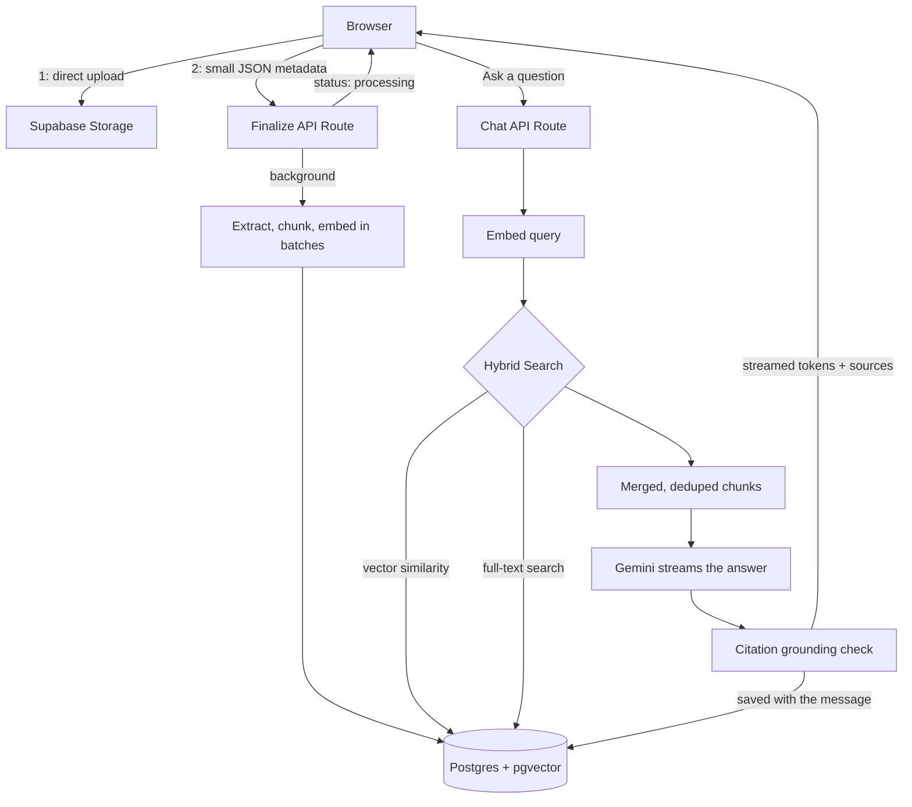

# RAG Assistant

**A multi-tenant document Q&A platform.** Upload your documents, ask questions, and get answers grounded in your own content with citations that are checked against the source. Built end to end: workspace isolation enforced in the database, hybrid retrieval, citation verification, team accounts, a built-in evaluation harness, and a custom UI with WebGL visuals.

🔗 **[Live demo](https://rag-assistant-gamma.vercel.app)** · 📦 [Source](https://github.com/mKs2609/rag-assistant)

[](https://github.com/mKs2609/rag-assistant/actions/workflows/ci.yml)


---

## Why this isn't just another "chat with your PDF" demo

Most RAG tutorials stop at: embed one PDF, run a vector search, paste the result into a prompt. That is a fine starting point, and it is also where most student projects end. This one goes further on the parts that matter once more than one person uses it:

- **Multi-tenant from the database up.** Every table and the storage bucket enforce workspace isolation with Postgres Row-Level Security, not application-level `if` statements that are easy to forget. The full schema, including every policy, is in [`/schema`](schema).
- **Hybrid retrieval, not just vector search.** Embedding search is weak at exact lookups such as a certificate code or an ID number. This runs pgvector cosine similarity and Postgres full-text search side by side and merges the results, because they catch different kinds of questions.
- **Citations are checked, not trusted.** After the model answers, each citation is compared against the text it claims to be quoting, and answers show a verified or unverified badge per source.
- **It measures itself.** A built-in evaluation harness scores retrieval and answer accuracy against saved question and answer pairs, so changes can be checked instead of guessed at.
- **Rate limiting on every endpoint that costs money:** chat, upload, evaluation runs, and signup.
- **A real infrastructure limit, solved rather than worked around.** Vercel caps serverless request bodies at 4.5MB, which breaks file uploads. Uploads now go straight from the browser to storage, and only small metadata passes through the function. See [Engineering decisions](#engineering-decisions) below.

## Features

**Chat and retrieval**
- Hybrid vector and keyword search over chunked, embedded documents
- Conversation memory, so follow-up questions work without repeating context
- Per-conversation document scoping, with an inline picker to attach more documents mid-chat
- Streaming answers with live progress: searching, how many passages were found, then writing
- Citation grounding checks, saved with the answer so they survive a reload
- Delete a question and its answer, with failed sends cleaned up automatically
- Voice input and read-aloud using the browser's built-in speech APIs
- Shared chats show who asked each question
- Conversation history with rename, pin, delete, and plain-text export

**Teams**
- Workspaces with owner, admin and member roles
- Single-use invite links that expire after 7 days
- Shared conversations, where only the author or an owner/admin can rename, pin or delete
- Member management, including removing members

**Evaluation**
- Save question and answer pairs with an expected document and expected keywords
- Score retrieval accuracy and answer accuracy, for the whole set or one question
- Questions that fail because the model was unavailable are excluded from the score

**Documents**
- PDF, TXT and MD up to 10MB, uploaded straight from the browser to storage
- Scanned PDFs fall back to OCR, so image-only documents are still searchable
- Processing runs in the background, so uploads return immediately and the list updates itself
- Embeddings are sent in batches, so large documents don't exceed the provider's per-request limit

## Architecture



## How it works

| Step | Detail |
|---|---|
| Chunking | 1000 characters with 150 characters of overlap |
| Embeddings | Voyage AI `voyage-3.5`, 1024 dimensions, in batches of up to 128 chunks |
| Retrieval | Top 5 by vector similarity plus top 5 by full-text search, merged and deduped to 6 |
| Conversation memory | The last 10 messages are replayed to the model |
| Citation check | A citation is verified when at least 30% of the sentence's significant words appear in the cited chunk |
| Rate limits | Chat 15 per 5 min, uploads 10 per 10 min, evaluations 5 per 10 min, signups 5 per hour per IP |

## Security

- Row-Level Security on every table and on the storage bucket, all expressed through one `auth_tenant_id()` helper
- Storage paths are prefixed with the workspace id, and the server checks the prefix before trusting a client-supplied path
- IDOR protection on document, conversation and message routes, with workspace filters in the API as a second layer
- Prompt-injection defense: retrieved content is passed as untrusted reference material, never as instructions
- Invite links are claimed atomically, so the same link cannot be used twice at the same moment
- Signup errors don't reveal whether an email is already registered
- File size is enforced on the server, not just in the browser
- The rate-limit table has RLS enabled with no policy, so only the service role can touch it

## Engineering decisions

**The 4.5MB wall.** Uploads worked locally and then failed in production for anything over a few megabytes, with no error from my own code. Vercel enforces a 4.5MB request body limit on serverless functions at the infrastructure level, and no application config overrides it. The fix was to take the file out of the request entirely. The browser uploads directly to Supabase Storage under the same RLS policies that already govern workspace access, and only a storage path and filename go through the function.

**Why hybrid retrieval.** Testing with real documents, such as certificates containing codes like `9977287`, showed that vector search sometimes missed the chunk holding an exact code, because embeddings capture meaning rather than exact tokens. Running Postgres full-text search alongside it closed the gap without adding infrastructure, since full-text search is already part of Postgres.

**Citation verification for free.** The usual approach is a second LLM call, which costs money per check and adds latency. This compares the significant words of a cited sentence against the source chunk instead. It is less sophisticated than a model-based check, but it catches the failure that matters, a citation that does not match its source, at no extra cost.

**Processing off the request path.** Extracting and embedding a large PDF takes far longer than a request should. Processing now runs after the response is sent, using Next.js `after()` with an explicit time budget, and the document list polls until the status changes. Uploading a large file no longer blocks the browser or times out silently.

**OCR only when it's needed.** Scanned PDFs hold images rather than text, so extraction returned nothing and the upload failed. Rather than add an OCR engine to the serverless function, which is slow and heavy, the pipeline falls back to Gemini when a PDF yields almost no text and asks it to transcribe the pages. Normal PDFs never pay that cost, and it reuses the API key that was already there.

**Handling a busy model.** Gemini returns 503 when it is under load, and a single attempt failed often enough to be a problem. Requests now retry with backoff before giving up, and the user sees a short message rather than a raw API error. A failed question is removed from the chat instead of being left unanswered.

## Tech stack

| Layer | Choice |
|---|---|
| Framework | Next.js 16 (App Router), TypeScript |
| Styling | Tailwind CSS v4 |
| Database | PostgreSQL via Supabase, with `pgvector` |
| Auth | Supabase Auth |
| File storage | Supabase Storage |
| Embeddings | Voyage AI (`voyage-3.5`) |
| LLM | Google Gemini |
| Deployment | Vercel |
| Custom visuals | Raw WebGL via `ogl`, no animation library |
| Tests | Vitest, covering chunking, batching, citation checks and the OCR trigger |
| CI | GitHub Actions running lint, typecheck, tests and build |

## Getting started

```bash
git clone https://github.com/mKs2609/rag-assistant.git
cd rag-assistant
npm install
```

Create `.env.local`:

```
NEXT_PUBLIC_SUPABASE_URL=
NEXT_PUBLIC_SUPABASE_ANON_KEY=
SUPABASE_SERVICE_ROLE_KEY=
VOYAGE_API_KEY=
GEMINI_API_KEY=
```

Create a Supabase project, then run the files in [`/schema`](schema) in order (`001` to `010`) in the SQL Editor. They create the tables, indexes, search functions, RLS policies and the storage bucket, and can be re-run safely. Then:

```bash
npm run dev
```

Other scripts:

```bash
npm run lint       # eslint
npm run typecheck  # tsc --noEmit
npm test           # vitest
npm run build      # production build
```

## Project structure

```
app/
  api/           # chat, documents, conversations, messages, eval, team, invites, profile, tenants
  dashboard/     # main authenticated UI: chat, documents, evaluation, team
  login/ signup/ # auth pages
  invite/        # public invite acceptance page
components/      # custom WebGL visual components
lib/
  __tests__/     # unit tests for the pure functions
  documents/     # chunking, embedding and processing pipeline
  citations.ts   # citation grounding check
  ocr.ts         # OCR fallback for scanned PDFs
  gemini.ts      # Gemini calls with retry on busy responses
  hooks/         # speech recognition and synthesis
  supabase/      # browser, server and admin clients
schema/          # SQL migrations, run in order
```

## Known gaps

- **Email addresses aren't verified at signup.** Accounts are created as confirmed, so anyone can register with any address. Doing this properly needs an email provider configured in Supabase.
- **Any workspace member can delete any document.** Documents are shared, and deletion isn't restricted to the uploader.

## Roadmap

- Email verification at signup
- Model-based citation verification as an optional higher-fidelity mode
- Support for embedding providers beyond Voyage AI

## License

MIT, see [LICENSE](LICENSE).

---

Built by Mohit Kumar.
