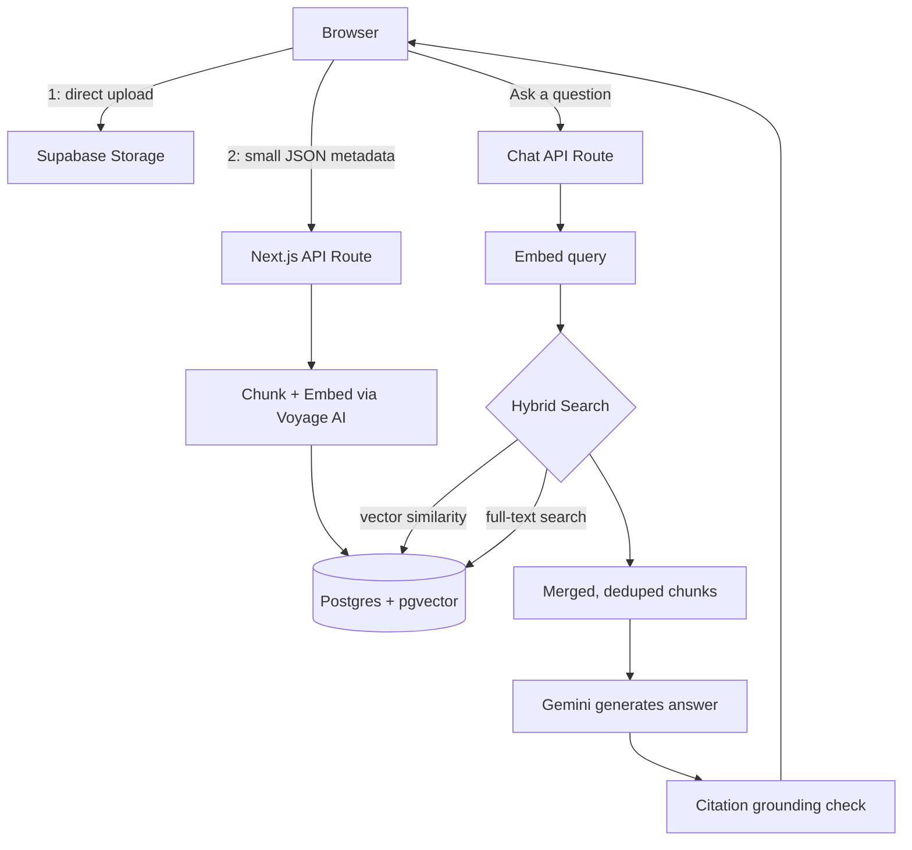

# RAG Assistant

**A production-grade, multi-tenant document Q&A platform** — upload your documents, ask questions, get answers grounded in your own content with verifiable citations. Built end-to-end: secure multi-tenant architecture, hybrid retrieval, automated citation verification, and a fully custom UI with WebGL-rendered visual identity.

🔗 **[Live demo](https://rag-assistant-gamma.vercel.app)** · 📦 [Source](https://github.com/mKs2609/rag-assistant)


---

## Why this isn't just another "chat with your PDF" demo

Most RAG tutorials stop at: embed one PDF, do a vector search, paste the result into a prompt. That's a fine starting point — and also where most student projects end. This one goes further, on the parts that actually matter in production:

- **Multi-tenant from the database up.** Every table enforces tenant isolation via Postgres Row-Level Security, not application-layer `if` statements that are easy to get wrong.
- **Hybrid retrieval, not just vector search.** Pure embedding search is genuinely bad at exact lookups — a certificate code, an ID number, a specific term. This runs vector search (pgvector cosine similarity) and PostgreSQL full-text search side by side, merging results, because they're good at catching different kinds of questions.
- **Citations are checked, not trusted blindly.** After the model answers, every citation it makes gets checked against the actual source text it claims to be quoting — a real, if lightweight, grounding pass, not just "the model said so."
- **Rate limiting on every cost-bearing endpoint** — chat, upload, and signup — not just the obvious one.
- **A real infrastructure constraint, solved properly, not worked around.** Vercel's serverless functions cap request bodies at 4.5MB — a hard, undocumented-until-you-hit-it wall for file uploads. Rather than fighting it, uploads go directly from the browser to storage, with the serverless function only ever handling small metadata. See [Engineering Decisions](#engineering-decisions--challenges) below for the full story.

## Key Features

**Retrieval & Chat**
- Hybrid vector + keyword search over chunked, embedded documents
- Per-conversation document scoping — focus a chat on specific documents, attach more mid-conversation via an inline picker
- Citation grounding checks on every generated answer
- Full conversation history: rename, pin, delete

**Security**
- Row-Level Security enforced tenant isolation on every table and storage bucket
- IDOR protection on every document/conversation route
- Prompt-injection defense — retrieved content is explicitly wrapped as untrusted reference material, never as instructions
- Rate limiting: chat, document upload, and signup (IP-based, since signup has no session yet)
- Enumeration-resistant signup error messages
- Server-side file size enforcement (not just a client-side check that's trivial to bypass)

**Engineering**
- Direct-to-storage upload architecture, bypassing platform-level payload limits entirely
- Custom WebGL/Canvas visual components built from raw shader and rendering code (not a UI library) — a dark, cohesive design system with a single signature chromatic element
- Fully responsive, including a collapsible mobile navigation drawer and dynamic-viewport-height handling for mobile browser chrome

## Architecture



## Engineering Decisions & Challenges

A few problems worth calling out specifically, since the reasoning behind them says more than the feature list:

**The 4.5MB wall.** Uploads worked flawlessly in local development, then failed in production for any file over a few megabytes — with no error from my own code at all. The cause: Vercel enforces a hard 4.5MB request-body limit on serverless functions, at the infrastructure level, un-overridable by any application config. The fix wasn't a bigger limit — it was removing the file from the request entirely. The browser now uploads directly to Supabase Storage using the same RLS policies that already govern tenant access, and only a small JSON payload (a storage path and filename) goes through the serverless function. The file itself never touches a function with a size ceiling.

**Why hybrid retrieval, specifically.** Testing with real documents (certificates with exact codes like `9977287`) surfaced a real gap: pure vector search occasionally failed to surface a chunk containing an exact code, because embeddings encode meaning, not precise tokens. Running Postgres full-text search alongside the vector search — and merging results — closed that gap without adding any new infrastructure, since full-text search is already built into Postgres.

**Citation verification, done for free.** Verifying citations with a second LLM call is the more common approach — but it costs real money per check and adds latency. Instead, this compares the significant words in a model's cited sentence against the actual source chunk, using plain text overlap. Not as sophisticated as a model-based check, but it catches the important failure mode — a citation that doesn't actually match its source — at zero marginal cost.

## Tech Stack

| Layer | Choice |
|---|---|
| Framework | Next.js 16 (App Router), TypeScript |
| Styling | Tailwind CSS v4 |
| Database | PostgreSQL via Supabase, with `pgvector` |
| Auth | Supabase Auth |
| File storage | Supabase Storage |
| Embeddings | Voyage AI (`voyage-3.5`) |
| LLM | Google Gemini |
| Deployment | Vercel |
| Custom visuals | Raw WebGL (via `ogl`) and Canvas 2D — no animation library |

## Getting Started

```bash
git clone https://github.com/mKs2609/rag-assistant.git
cd rag-assistant
npm install
```

Create `.env.local` with:
```
NEXT_PUBLIC_SUPABASE_URL=
NEXT_PUBLIC_SUPABASE_ANON_KEY=
SUPABASE_SERVICE_ROLE_KEY=
VOYAGE_API_KEY=
GEMINI_API_KEY=
```

Run the SQL migrations in `/schema` against a Supabase project, then:
```bash
npm run dev
```

## Project Structure

```
app/
  api/           # Route handlers: chat, documents, conversations, tenants
  dashboard/     # Main authenticated UI
  login/ signup/ # Auth pages
components/      # Custom WebGL/Canvas visual components
lib/
  documents/     # Chunking, embedding, and processing pipeline
  supabase/      # Client, server, and admin Supabase clients
```

## Roadmap

- OCR support for scanned/image-based documents
- Model-based citation verification as an optional, higher-fidelity mode
- Additional embedding provider support beyond Voyage AI

## License

MIT — see [LICENSE](LICENSE).

---

Built by Mohit Kumar.
